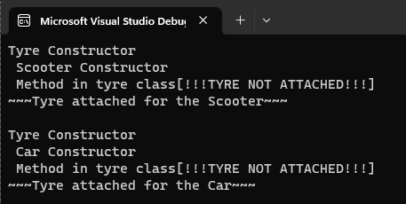

# Inheritance

## Aim:
To write a C# program to print some messages using hierarchical inheritance.

## Algorithm:
### Step 1:
Create a base class.

### Step 2:
Create two child class.

### Step 3:
Create a constructor in the base class and print a message.

### Step 4:
Create constructor in child classes to print the message.

## Program:
```
Developed by: P.SANDEEP
Register number: 212221230074
```
```
using System;
namespace exp_08
{
    class Tyre
    {
        public Tyre()
        {
            Console.Write("Tyre Constructor\n ");
        }
        public virtual void display()
        {
            Console.WriteLine(" Method in tyre class[!!!TYRE NOT ATTACHED!!!]");
        }
    }

    class Scooter : Tyre
    {
        public Scooter()
        {
            Console.WriteLine("Scooter Constructor "); 
        }
        public override void display()
        {
            base.display();
            Console.WriteLine("~~~Tyre attached for the Scooter~~~");
            
        }
    }
    class Car : Tyre
    {
        public Car()
        {
            Console.WriteLine("Car Constructor");
        }
        public override void display()
        {
            base.display();
            Console.WriteLine("~~~Tyre attached for the Car~~~");
     
        }
    }
    public class CarScooter
    {
        static void Main(string[] args)
        {
            Scooter scooter = new Scooter();
            scooter.display();
            Console.WriteLine();
            Car car = new Car();
            car.display();
        }
    }
}

```

## Output:



## Result
Thus, C# program to print some messages using hierarchical inheritance is implemented successfully.